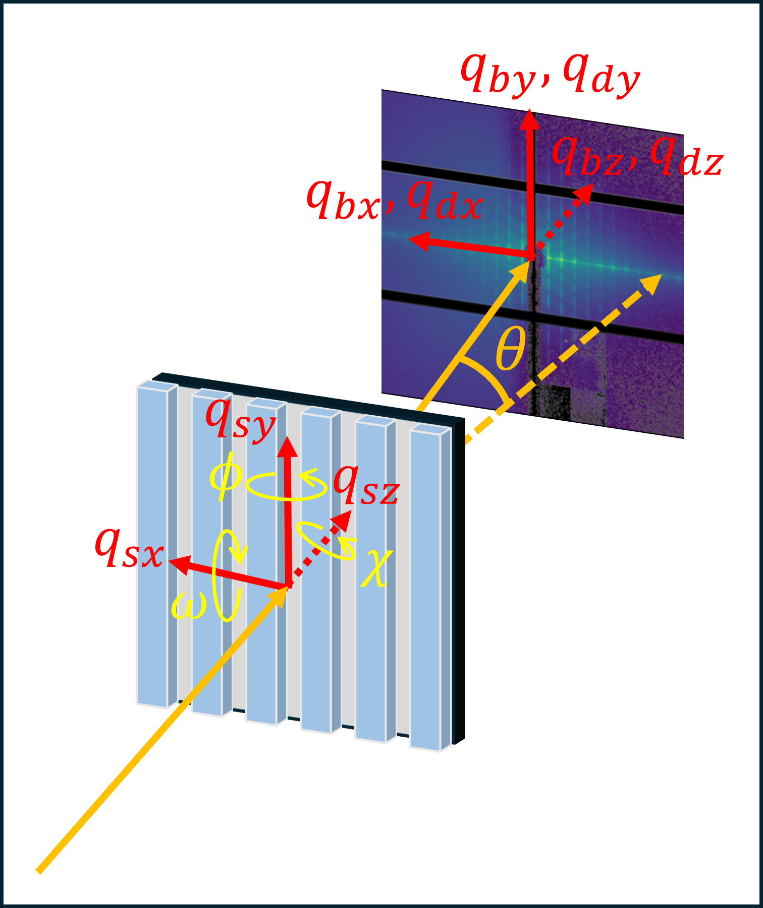

# nist_cdsaxs
The purpose of the 'nist_cdsaxs' software is to enable reduction of 
transmission critical-dimension small-angle X-ray scattering (CD-SAXS) 
data. It converts the scattering vector, $q$, from beam- or 
detector-based coordinates to sample-based coordinates. 

Reduced CD-SAXS data slices, i.e. 1D scattering intensity 
as a function of the z component of q (z axis is along sample depth) can 
be exported and used directly with the 
[`nist_cdsaxs_analysis`](https://github.com/usnistgov/nist_cdsaxs_analysis)
repository.

## Software Status
Latest version can be found here: ['Release list'](https://github.com/usnistgov/nist_cdsaxs/releases)

Unless otherwise stated here, the code will be regularly maintained by the developers 
to address any functionality bugs and security issues, including required loader 
updates to reflect changes in data structures exported by the beamlines.

## Installation

The package follows a standard Python layout (`src/` with `pyproject.toml`). You can install it with pip.

Basic install (recommended):

```bash
pip install --upgrade pip setuptools wheel
pip install .
```

Editable/developer install with optional dev tools:

```bash
pip install --upgrade pip setuptools wheel
pip install -e .[dev]
```

> [!NOTE]
> If you use conda/mamba, create and activate an environment first, then run the pip commands above.
>
> The `-e` (editable) install lets you modify the source and use the changes without re-installing.

### Create and Activate Environment
1. Install Python with the conda package manager on your machine if it is not already installed. One open source option is [Miniforge](https://github.com/conda-forge/miniforge).
2. Open a terminal (e.g., GitBash, Command Prompt on Windows, Terminal on Mac) and navigate to the root folder of the project using the `cd` command.
3. Create a Python environment; replace 'cdsaxs_dev' with another environment name if you wish:
```
conda create --name cdsaxs_dev python
```
> [!IMPORTANT]
> If you're using a Jupyter notebook, use `conda create --name cdsaxs_dev python ipykernel` to install ipykernel as well. Installation with pip did not work in our testing.
> 

4. Activate the environment, replacing `cdsaxs_dev` with your environment name if it is different.
```
conda activate cdsaxs_dev
```
After activating the development environment, install the repo in editable mode:

```
pip install -e .[dev]
```

This is preferred over manually modifying `PYTHONPATH`.

## Usage
This software is meant to be used in a Jupyter notebook. While some
aspects of the reduction can be automated as a Python script, currently
we recommend a notebook as visual checks that the data is integrated 
appropriately are important.

An example Jupyter notebook has been provided in `examples`. It outlines
the required reduction steps as well as some of the additional 
functionality included in this software. Please follow this notebook 
and the included descriptions carefully as some steps need to be 
performed in order.

To run the notebook via Jupyter lab in a browser:
1. Ensure that `nist_cdsaxs` is installed following the directions above.
2. In the terminal, navigate to the `examples` folder in this repository.
3. Activate the Python environment in which `nist_cdsaxs` is installed. 
For example, if the environment is called `cdsaxs_dev`, this command would 
be:
```
conda activate cdsaxs_dev
```
4. Launch Jupyter lab with the following command:
```
jupyter lab
```
5. Your browser should open up Jupyter lab automatically and the 
available notebooks will be shown in the file browser on the left of 
the screen. If you browser did not open, you may need to type in the 
address provided in the terminal after you run step 4.

> [!NOTE]
> You can also run the Jupyter notebook from any compatible IDE, such as
> VS Code. Click on the file and make sure to select the appropriate 
> Python environment to run the notebook.


## Coordinate Conventions and Variables
All data imported into this software should follow the coordinate
conventions defined below. This may require assigning metadata named according to the
beamline's coordinate conventions appropriately to this software's
naming convention. Image transformations, such as rotations or flips, 
may also be required to ensure the data is processed correctly. While 
some of the beamline-specific data loaders have made an attempt to do
this upon import, we encourage the user to confirm data is loaded 
correctly as beamline conventions and data export formats can change 
over time.

Figure 1 shows the coordinate conventions for a typical
transmission CD-SAXS measurement where the primary rotation of the 
sample is defined as $\phi$, and the scattering angle is defined as 
$\theta$. There are three coordinate systems: sample-based, detector-
based, and beam-based coordinates. The subscript of $s$, $d$, or $b$ 
indicates the coordinate base. The sample coordinate system is
defined with the origin at the center incident position of the beam on 
the sample. The sample is normal to the incident beam when the sample rotation 
angles are all zero. At normal incidence, the $z$ axis aligns with the beam path and 
the $y$-axis is the primary rotation axis during the measurement. The origin for the 
detector-based and beam-based coordinate systems is positioned at the 
incident position of the transmitted beam onto the detector at its face. The 
detector is normal to the incident beam. The $y$-axes are always parallel. 
The $z$-axes and $y$-axes are all parallel when the sample is positioned at normal incidence.

<div style="max-width: 500px; margin: 0 auto;">
  
  <p><strong>Figure 1.</strong> Coordinate system of transmission CD-SAXS measurement as 
  defined in the nist_cdsaxs software.</p>
</div>

The software can also reduce data from a CD-SAXS measurement where the 
detector rotates about the positive $y_s$ axis and translates along the
$y_d$ axis. This may occur when X-ray source energy is low and the 
scattering angles are high. In this case, the detector-based and beam-
based coordinate systems diverge, as shown in Figure 2. The origin in the 
beam-based coordinate system remains at the incident position of the 
transmitted beam and the detector when the detector is at the normal 
incidence position prior to any rotation or translation. The origin in 
the detector-based coordinate system follows the same location on the 
detector phase as it rotates. This detector rotation angle is shown as 
$\phi_d$ in the image.

<div style="max-width: 500px; margin: 0 auto;">
  
  <p><strong>Figure 2.</strong> Coordinate system of transmission CD-SAXS measurement as 
  defined in the nist_cdsaxs software with a rotation of the detector about 
  positive y-axis in sample coordinate space.</p>
</div>

The scattering vector, $q$, and it's x-, y-, and z-components can be 
defined in any of the coordinate systems using the `nist_cdsaxs` software. 
At normal incidence of the sample and detector, the q-components are identical, e.g., $q_{sx}=q_{dx}=q_{bx}$. 
All variables defined in Figures 1 and 2 are summarized in Table 1. The table 
also matches these quantities to the corresponding variable name(s) in the 
`nist_cdsaxs` software.


**Table 1.** variable definitions from Figures 1 and 2 and their corresponding 
variable name in the `nist_cdsaxs` software.

| Figure Variable | Variable Name in `nist_cdsaxs` | Definition | Units |
| --- | --- | --- | --- |
| $\theta$ | `theta_deg` | Scattering angle; angle between the transmitted and scattered beam. | degrees |
| $q$ | `q` | Scattering vector. | ${Å}^{-1}$ |
| $q_{sx}$ | `qsx` | Scattering vector x-axis component in sample-coordinate space. | ${Å}^{-1}$ |
| $q_{sy}$ | `qsy` | Scattering vector y-axis component in sample-coordinate space. | ${Å}^{-1}$ |
| $q_{sz}$ | `qsz` | Scattering vector z-axis component in sample-coordinate space. | ${Å}^{-1}$ |
| $q_{bx}$ | `qbx` | Scattering vector x-axis component in beam-coordinate space. | ${Å}^{-1}$ |
| $q_{by}$ | `qby` | Scattering vector y-axis component in beam-coordinate space. | ${Å}^{-1}$ |
| $q_{bz}$ | `qbz` | Scattering vector z-axis component in beam-coordinate space. | ${Å}^{-1}$ |
| $q_{dx}$ | `qdx` | Scattering vector x-axis component in detector-coordinate space. | ${Å}^{-1}$ |
| $q_{dy}$ | `qdy` | Scattering vector y-axis component in detector-coordinate space. | ${Å}^{-1}$ |
| $q_{dz}$ | `qdz` | Scattering vector z-axis component in detector-coordinate space. | ${Å}^{-1}$ |
| $\phi$ | `sample_phi_deg` + `sample_phi_offset_deg` | Primary sample rotation; counterclockwise about positive y-axis in sample-coodrinate space. | degrees |
| $\chi$ | `sample_chi_deg` + `sample_chi_offset_deg` | Counterclockwise sample rotation about positive z-axis in sample-coodrinate space. | degrees |
| $\omega$ | `sample_omega_deg` + `sample_omega_offset_deg` | Counterclockwise sample rotation about positive x-axis in sample-coodrinate space. | degrees |
| $\phi_d$ | `detector_phi_deg` - `detector_phi0_deg` | Detector rotation angle about the positive $y_s$ axis. | degrees |
| $\Delta d_y$ | `detector_y_mm` - `detector_y0_mm` | Detector translation along the $y_d$ axis. | mm |

> [!NOTE]
> Some properties above are defined as the summation or difference of two variables in 
> the software. These include $\phi$, $\chi$, $\omega$, and $\phi_d$. The offsets by 
> default are always set to 0. However, if there is a difference between the nominal 0 position 
> and normal incidence, an offset can be applied by the user to correct for this.

All metadata is stored in the `metadata` attribute
of the `Data2D` class. Please refer to the example Jupyter notebook for more 
information about how to access this attribute. Table 1 below provides a summary 
of accepted metadata that can be imported into the software. Users can also store 
additional information in the `user_params` attribute. These quantities can be used to 
perform data transformations, such as normalizations, but are not standard metadata 
recognized by the software and the user is responsible for applying these properties correction. 
Additional metadata required for specific corrections, including the footprint correction 
and absoprtion correction, are introduced in greater detail in the example notebook.

**Table 2.** Metadata of the `nist_cdsaxs` software.

| Metadata in `nist_cdsaxs` | Definition | Units |
| --- | --- | --- |
| `wavelength_nm` | X-ray source wavelength. | nm |
| `energy_ev` | X-ray source energy. | eV |
| `sdd_cm` | Sample-to-detector distance. | cm |
| `exposure_time_s` | Count time of the measurement. | s |
| `pixel_size_um` | Pixel size of the detector. | $\mu m$ |
| `data_directory` | String that specifies the path to the directory containing the file from which the data was imported. | None |
| `filename` | String that specifies the name of the file from which the data was imported. | None |
| `name` | String; name of the data that also corresponds to the key for this Data2D class in the datas attribute of Dataset. See example notebook for more details. | None |
| `center_px` | Tuple; beam center position in pixels (center_row, center_column) starting from the top left of the image where rows are counted from top to bottom and columns are counted from left to right. | None |


## Citation Information
_More information about citation information will be available soon._

## Contact Information
You can communicate with the `nist_cdsaxs` owners via e-mail:   
Daniel Sunday daniel.sunday@nist.gov  
Joseph Kline r.kline@nist.gov  

## Issue Reporting
We encourage users to submit issues regarding feature requests or bug fixes 
directly using [GitHub issues](https://github.com/usnistgov/nist_cdsaxs/issues) on our repository.

## Contributors
Dean M. DeLongchamp, [@delongchamp](https://github.com/delongchamp)  
Joseph Kline, [@rjkline](https://github.com/rjkline)  
Christopher Liman  
Logan Magaha, [@lgackey](https://github.com/lgackey)  
Daniel Sunday, [@dsunday](https://github.com/dsunday)  
Matthew A. Wade, [@MatthewAWade](https://github.com/MatthewAWade)  
Caitlyn M. Wolf, [@caitwolf](https://github.com/caitwolf)  

_Contributors are listed in alphabetical order by last name._


## Related Material
* [Metrology for Nanolithography Project](https://www.nist.gov/programs-projects/metrology-nanolithography)
* [National Institute of Standards and Technology](http://www.nist.gov)   
* [Material Measurement Laboratory](https://www.nist.gov/mml)   
* [Materials Science and Engineering Division](https://www.nist.gov/mml/materials-science-and-engineering-division)   
* [Polymers Processing Group](https://www.nist.gov/mml/materials-science-and-engineering-division/polymers-processing-group) 

## Disclaimers

A portion of this repository (approximately 5%-10%), including source 
code and documentation, was written with the assistance of artificial 
intelligence (AI). All code and text generated by the AI models has been 
reviewed and tested by a human developer. 

Certain commercial or open-source software may be identified in this project to foster understanding. Such identification does not imply recommendation or endorsement by the National Institute of Standards and Technology, nor does it imply that the software identified are necessarily the best available for the purpose.
